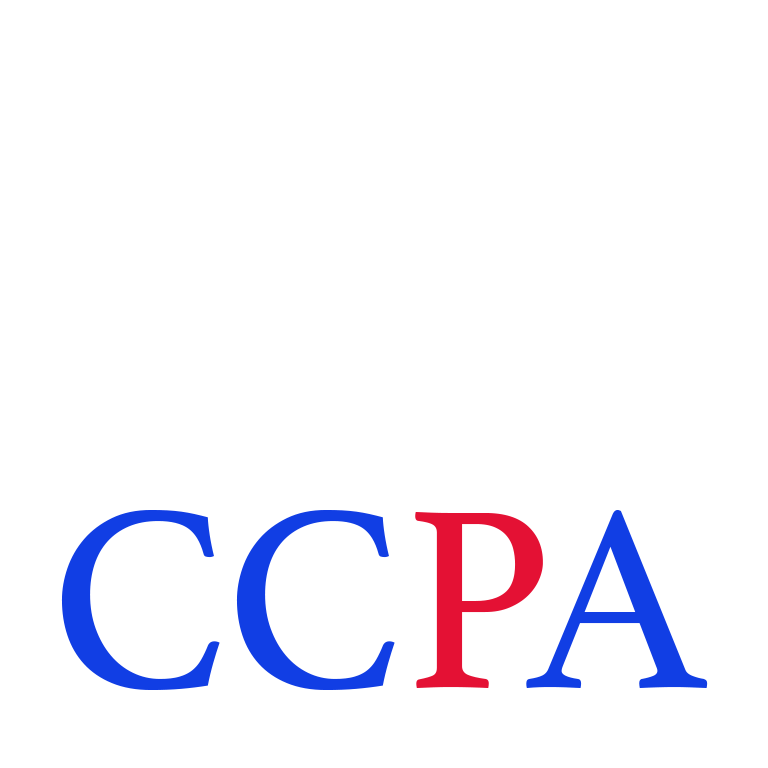
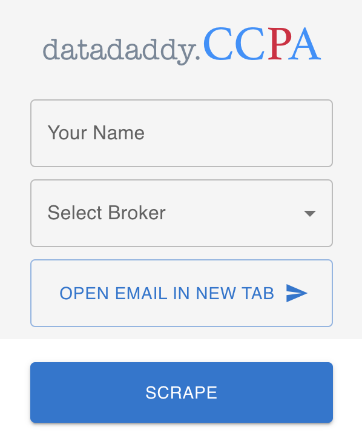

#  Data Daddy v3.1

# 

## TO-DO

### Scraper
- [X] Add RegEx to parse emails
- [ ] Integrate crawler

### Form Filling Automation
- [X] Touch base with OneTrust
- [ ] Create Data Flow Diagram for OneTrust DSAR Module
- [ ] Research MUI AutoComplete

### Voice Assistant Integration
- [ ] Research Siri API
- [ ] Research Alexa API
- [ ] Research Google Assistant API

### NLP
- [X] Research NLP libraries in JavaScript/TypeScript
- [ ] Settle on library choice
- [ ] Develop and train model on Privacy Policies or Privacy Pages
